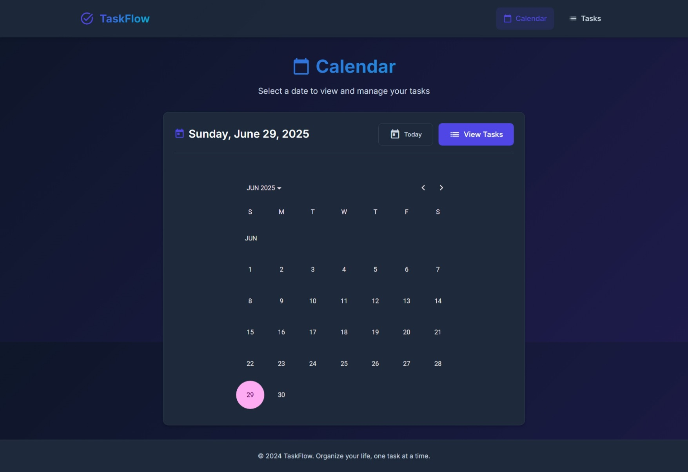
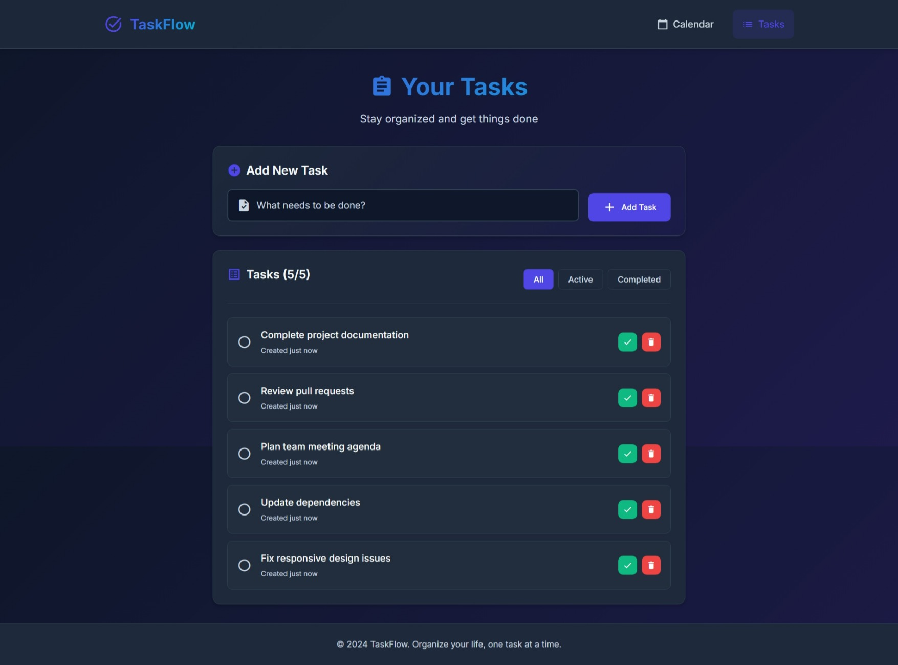

# TaskFlow - Modern Angular Todo List 📋

A beautiful, modern todo list application built with Angular 19, featuring a sleek dark theme, calendar integration, and intuitive task management.


### Quick Start

1. **Clone the repository**
   ```bash
   git clone <repository-url>
   cd todo-list
   ```

2. **Install dependencies**
   ```bash
   npm install
   ```

3. **Start the development server**
   ```bash
   ng start
   ```

4. **Open your browser**
   Navigate to `http://localhost:4200`


## Development

### Project Structure
```
src/
├── app/                    # Main application
│   ├── calendar/          # Calendar component
│   ├── task-list/         # Task list component
│   ├── app.component.*    # Root component
│   └── app.routes.ts      # Routing configuration
├── styles.css             # Global styles
└── index.html             # Main HTML file
```

## Screenshots

### Calendar Page


### Tasks page


## License

This project is open source and available under the [MIT License](LICENSE).
